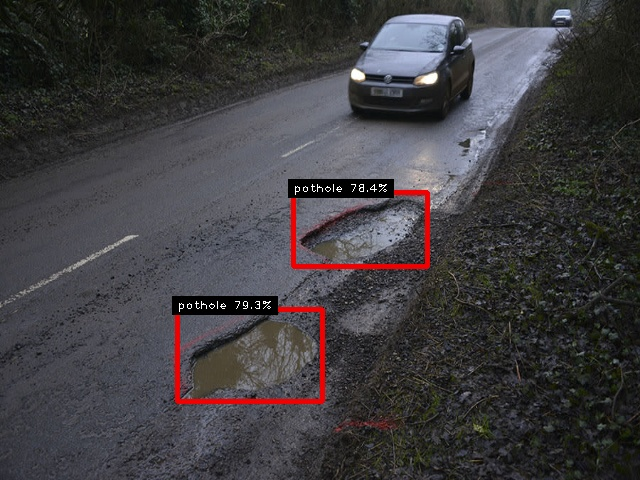
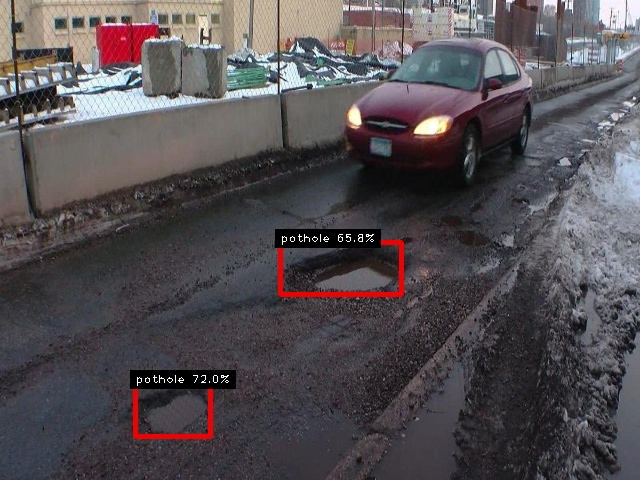
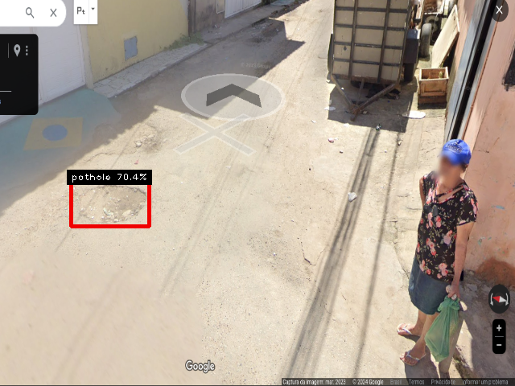
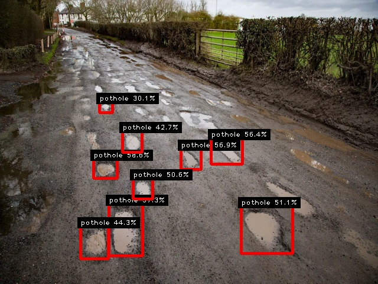

Detecção de objetos utilizando Opencv, atraves de um modelo YOLO com dataset customizado.


<br>
Codigo de predição baseado em:

https://docs.ultralytics.com/modes/predict/#key-features-of-predict-mode

https://www.aranacorp.com/en/object-recognition-with-yolo-and-opencv/

Dependencias necessarias:

*ultralytics

*opencv-python

*cvzone

exemplo de execução>

execução com imagem:
```
python detect-imagem.py --modelname=bestV2.pt --image=testImages/pothole2.png
```
 execução para um diretorio com imagens
```
python detect-imagem.py --modelname=bestV2.pt --imagedir=testImages
```
para video(mp4):
```bash
python detect-video.py --modelname=bestV2.pt --video=testVideos/video1.mp4
```



caso queira alterar a quantidade de detecções, adicione "--threshold= 0.5"
<br>
exemplo para 40%>
```
python detect-imagem.py --modelname=bestV2.pt --imagedir=testImages --threshold= 0.4

```
comparação de duas imagens. Uma com 50% e outra com 30%

detecção a partir de 50%
<br>

<br>
detecção a partir de 30%
<br>



